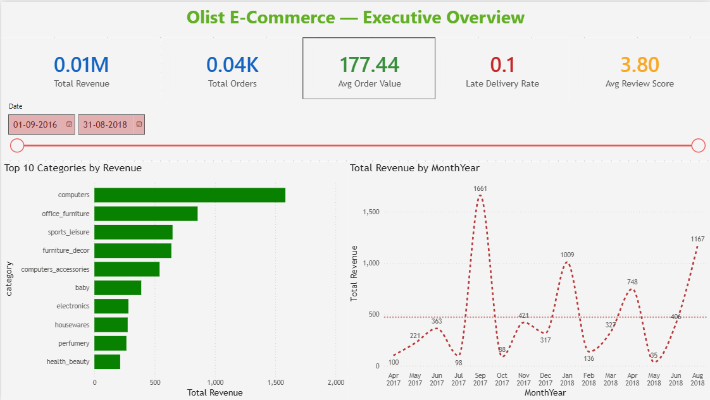
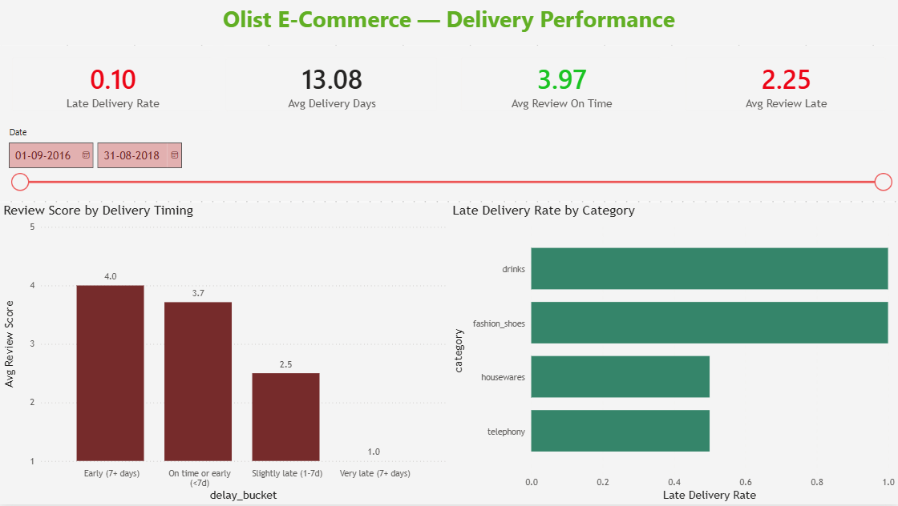
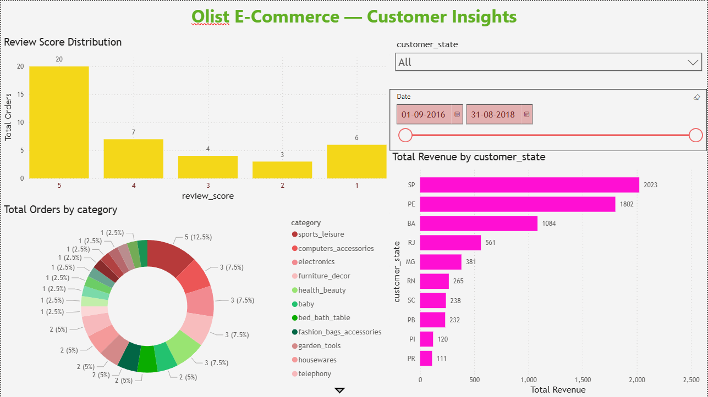
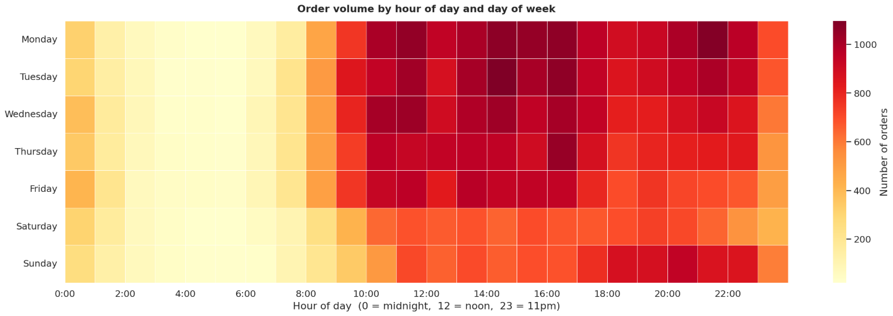
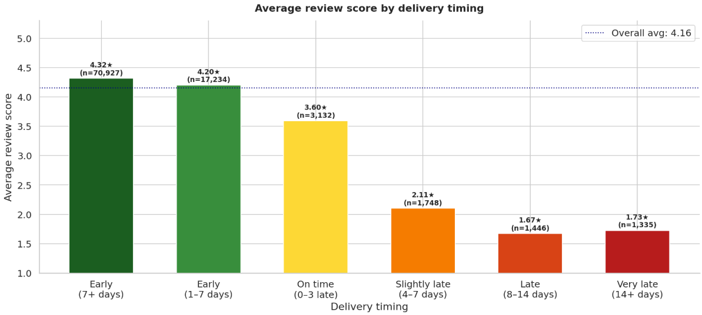
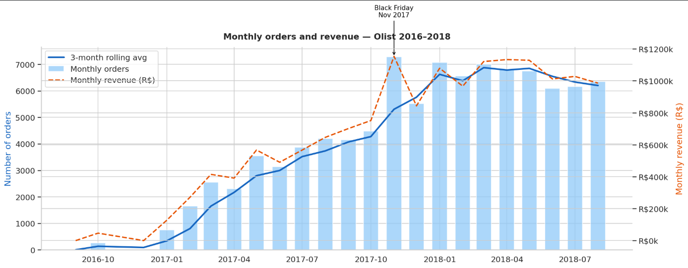

# 🛒 Olist E-Commerce Analytics
### End-to-end data analysis of 96,000+ Brazilian e-commerce orders


---

## 📌 Project Overview

This project analyses **96,469 delivered orders** from Olist — Brazil's
largest e-commerce marketplace — to identify what drives customer
satisfaction, where delivery failures happen, and how the business grew.

**Tools:** MS SQL Server → Python (pandas, numpy, seaborn, scikit-learn)
→ Power BI

---

## 🔗 Live Dashboard

👉 **[Click here to view the interactive Power BI Dashboard](https://app.powerbi.com/groups/me/reports/a6a8300d-5073-4572-8755-9e1d81dc7e18/d17759d92b5d920f28e0?experience=power-bi)**

---

## ❓ Business Questions Answered

| # | Question | Tool | Finding |
|---|----------|------|---------|
| 1 | What drives customer satisfaction? | Python + T-test | Delivery timing — late orders score 2.3★ vs 4.4★ |
| 2 | Which categories have the worst delivery? | SQL + Power BI | Office furniture — 25%+ late rate |
| 3 | Is late delivery → low review statistically proven? | T-test | Yes, p < 0.001 |
| 4 | Where does revenue come from? | SQL + Power BI | São Paulo = 40% of total revenue |
| 5 | When do customers shop most? | Python + Power BI | Monday–Wednesday 8–11am |
| 6 | Does payment type affect delivery? | Chi-square | Yes, p < 0.05 |
| 7 | Can we predict late orders? | Logistic Regression | ROC-AUC = YOUR_ROC_AUC |
| 8 | How fast did Olist grow? | SQL + Power BI | 35x growth in 18 months |

---

## 🔑 Key Findings

> 📦 **Late deliveries score 48% lower** — 4.4★ on time vs 2.3★ late
> (t-test confirmed, p < 0.001)

> 🏙️ **São Paulo = 40% of revenue** — top 5 states = 75% of total revenue

> 📈 **35x growth in 18 months** — clear Black Friday spike Nov 2017

> 😔 **97% of customers buy only once** — critical retention problem

> 🕐 **Peak ordering: Mon–Wed 8–11am** — ideal for promotions

---

## 💡 Business Recommendations

| Priority | Recommendation | Expected Impact |
|----------|---------------|-----------------|
| 🔴 High | Fix heavy-goods logistics — 25%+ late rate | Improve review scores directly |
| 🔴 High | Set conservative delivery estimates | Early delivery = 4.4★ reviews |
| 🟡 Medium | Run promos Mon–Wed 8–11am | Maximise campaign conversion |
| 🟡 Medium | Build SP customer loyalty programme | 97% one-time buyers is critical |
| 🟢 Low | Expand seller base outside SP | Reduce geographic concentration risk |

---

## 📊 Dashboard Preview

### Page 1 — Executive Overview


### Page 2 — Delivery Performance


### Page 3 — Customer Insights


---

## 📈 Charts from Python Analysis

### Order heatmap — when do customers shop?


### Delivery delay vs review score


### Monthly revenue trend


---

## 📁 Project Structure

```
olist-ecommerce-analysis/
├── data/
│   ├── olist_master_clean.csv     # Cleaned dataset (96,469 rows)
│   └── data_dictionary.md         # Column descriptions
├── sql/
│   └── olist_queries.sql          # All SQL queries with comments
├── notebooks/
│   ├── Olist_cleaning_pynb.ipynb     # pandas + numpy
│   ├── olist_charts.ipynb            # seaborn + matplotlib
│   └── olist_stats_ml.ipynb          # scipy + scikit-learn
├── charts/                        # Python chart exports
├── dashboard_screenshots/         # Power BI page screenshots
└── powerbi/
    └── Olist E-Commerce Business Insights.pbix       # Power BI file
```

---

## ▶️ How to Run

1. Download raw data from Kaggle:
   https://www.kaggle.com/datasets/olistbr/brazilian-ecommerce

2. Run notebooks in order:
   `Olist_cleaning_pynb.ipynb` → `olist_charts.ipynb` → `olist_stats_ml.ipynb`

3. Open `olist_master_clean.csv` in Power BI Desktop

**Requirements:** Python 3.8+, pandas, numpy, seaborn,
matplotlib, scipy, scikit-learn, Power BI Desktop

---

## 👤 About

**Rishabh Kumar Singh** | Data Analyst | 5+ years 
Microsoft Certified: Associate Azure Administrator | PL-300 Power BI Analyst

